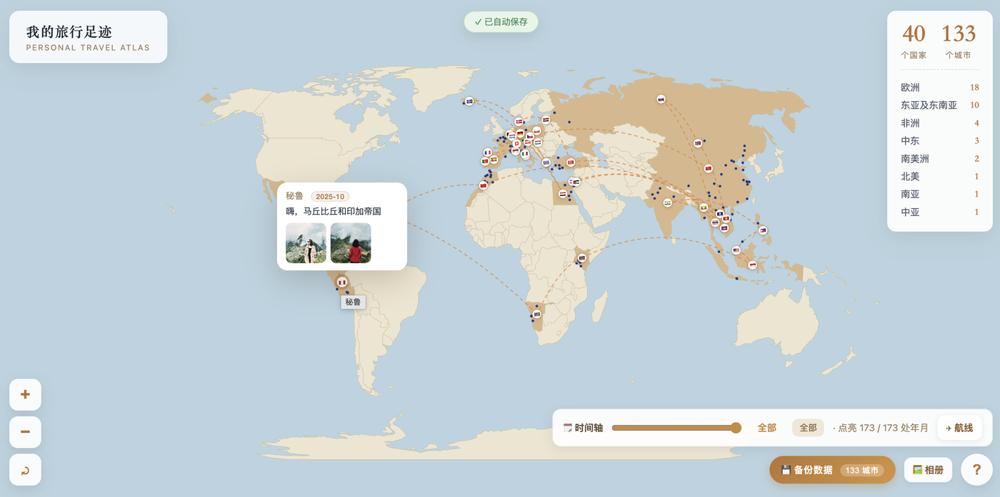

# 我的旅行足迹 🌍（分享版 · 从零开始）

一个**完全离线**的个人旅行地图网页。别人拿到这份文件夹后，从一张空白世界地图开始，**自己标记去过的国家和城市**、写故事、贴照片，数据只存在他**自己的浏览器**里，互不干扰，也不含任何别人的记录。

## 🖼 效果预览



*实拍示意：在世界地图上标记去过的国家/城市、查看旅行年月、按区域统计、底部时间轴回看航线。*

## 🚀 怎么打开（推荐双击启动器）

- **macOS**：双击 `启动旅行地图.command`
- **Windows**：双击 `启动旅行地图.bat`（需已装 Python）
- 启动器会在本地起一个小型服务并自动打开浏览器。**这样数据才能稳定保存**（直接双击 `index.html` 用 `file://` 打开时，部分浏览器可能不保存）。

## ✍️ 怎么记录自己的旅行

1. **标记去过的国家**：在地图上**点任意国家**，弹窗里点「＋ 标记我来过」即可——该国立刻上色，并出现在左上角统计里；再点一次可取消。
2. **勾选去过的城市**：打开某国弹窗，在清单里勾选你去过的城市（已内置全球主要城市；没有的城市可在下方输入框手动添加）。
3. **写故事 / 传照片**：点城市或国家弹窗里的「✏️ 编辑简介/照片」，写文字、拖入照片即可。
4. **标旅行年月**：编辑时点「📅 旅行年月」填一下，国家/城市标题旁会出现年月，底部时间轴还能按年份回看、看逐年点亮的航线。

## 💾 数据在哪 / 怎么备份

- 所有记录（国家、城市、文字、照片）都自动存在**你自己的浏览器本地**（localStorage），**不联网、不发给任何人**。
- 想换电脑/长期保存：点右下角 **💾 备份数据** 下载一个 `travel-backup.json`；在别处用 **📂 恢复数据** 导入即可。

## 📁 文件结构

```
旅行地图分享版/
├─ 启动旅行地图.command   # macOS 一键启动
├─ 启动旅行地图.bat       # Windows 一键启动
├─ index.html             # 主程序
├─ data.js                # 城市主数据（内置全球主要城市）
├─ countries-data.js      # 世界国家主数据（自动生成，无需改动）
├─ saved-state.js         # 占位文件（实际数据在浏览器本地）
├─ assets/                # 地图数据 + D3.js（完全离线）
├─ photos/                # 照片存放目录
└─ screenshots/           # 效果截图（用于 README）
```

> 本工具不含任何预置的个人旅行记录，拿到即可从零使用。
